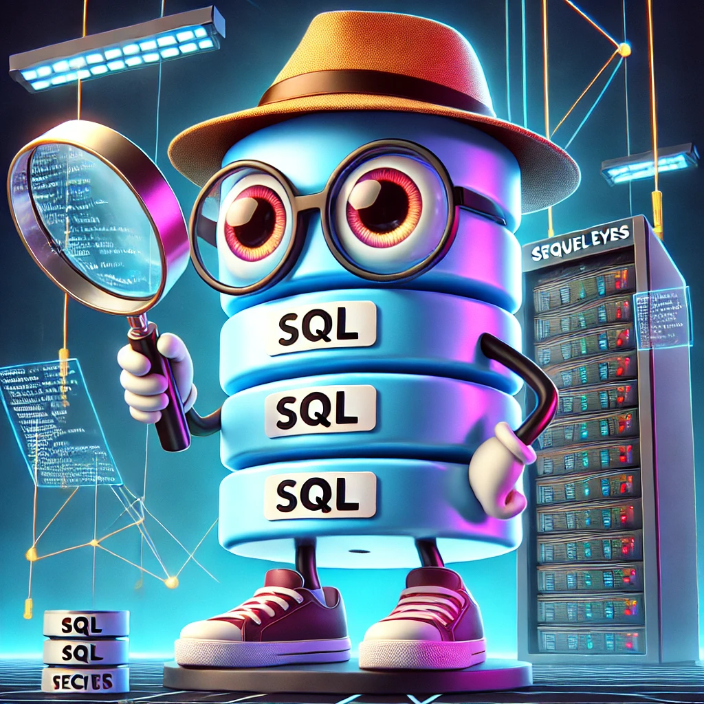

# SequelEyes 🔍

A comprehensive toolkit for SQL Server security testing, monitoring and web integration with IIS.



## 🌟 Overview

SequelEyes combines security testing tools for SQL Server with IIS integration capabilities. It provides a suite of PowerShell scripts for automated deployment, security validation, and web application integration - enabling security professionals, database administrators, and system administrators to build, test, and secure SQL Server environments.

## 🚀 Features

### SQL Server Security Testing Toolkit (SQLSSTT)
- **Automated SQL Server Installation**: Zero-touch deployment with secure defaults
- **Comprehensive Security Testing**: Test for common vulnerabilities and misconfigurations
- **Dual Testing Methods**: Uses both Invoke-Sqlcmd and sqlcmd.exe

### IIS Builder
- **Automated IIS Installation & Configuration**: Streamlined deployment of IIS with ASP.NET
- **SQL Server Integration**: Connect IIS web applications with SQL Server backends
- **Uninstallation Capabilities**: Clean removal of IIS components when needed

## 📋 Components

The toolkit consists of two main components:

### 1. SQLSSTT (SQL Server Security Testing Toolkit)
- `install-SQL.ps1`: Automated SQL Server installation script
- `SQLSSTT.ps1`: Main security testing script for SQL Server
- `sql-tester.ps1`: Verification script for SQL Server installation

### 2. IISBuilder
- `install_iis_aspnet.ps1`: Automated IIS with ASP.NET installation
- `sql_iis_setup.ps1`: Integration script for SQL Server and IIS
- `uninstall_iis_aspnet.ps1`: Script to remove IIS components

## ⚙️ Prerequisites

- Windows PowerShell 5.1 or later
- Administrative privileges
- 6GB+ free disk space for SQL Server installation
- Internet connectivity (for installer downloads)
- SQL Server PowerShell Module (optional, for enhanced functionality)
- SQL Server Command Line Utilities (optional)

## 🛠️ Quick Start

### SQL Server Security Testing

1. **Install SQL Server**
```powershell
cd SQLSSTT
.\install-SQL.ps1
```

2. **Run Security Tests**
```powershell
.\SQLSSTT.ps1 -Server "localhost" -Database "master" -Username "sa" -Password "YourSecurePassword"
```

3. **Verify Installation**
```powershell
.\sql-tester.ps1
```

### IIS Integration + Installation - Webshell testing

1. **Install IIS with ASP.NET**
```powershell
cd IISBuilder
.\install_iis_aspnet.ps1
```
3. **Remove IIS (if needed)**
```powershell
.\uninstall_iis_aspnet.ps1
```
## 🌟 Integrated IIS + SQL Server Setup

The most powerful feature of SequelEyes is the ability to automatically configure both IIS and SQL Server together in an integrated environment.

```powershell
.\sql_iis_setup.ps1
```

## 📊 Security Test Categories

- Basic Connectivity
- Authentication Patterns
- System Enumeration
- Configuration Tests
- Data Exfiltration Patterns
- Output Format Tests
- URL Input Tests
- xp_cmdshell Tests

## 🔒 Security Considerations

- Always test in controlled environments. Maybe just a lab.

## 📝 Logging

- SQL Server installation logs: `C:\SQL2022\InstallLogs\install.log`
- Test results: Console output with color-coded status indicators
- Detailed error messages and execution traces

## 🤝 Contributing

Contributions are welcome! Please feel free to submit pull requests or create issues for bugs and feature requests.

## 📄 License

This project is licensed under the Apache License 2.0 - see the [LICENSE](LICENSE) file for details.

---

Created with ❤️ by [The Haag](https://github.com/MHaggis)
GitHub: [https://github.com/MHaggis/SequelEyes](https://github.com/MHaggis/SequelEyes)